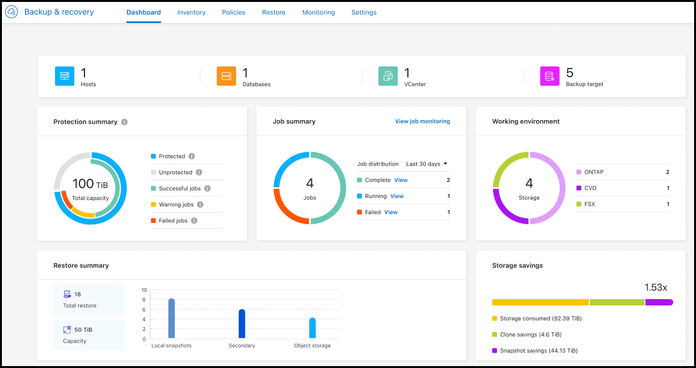

= 일반 공급(GA)에서 지원되는 Microsoft SQL Server 워크로드
:allow-uri-read: 

=== 일반 공급(GA)에서 지원되는 Microsoft SQL Server 워크로드

Microsoft SQL Server 워크로드 지원이 이제 NetApp Backup and Recovery 에서 일반적으로 사용 가능(GA)되었습니다. ONTAP, Cloud Volumes ONTAP 및 Amazon FSx for NetApp ONTAP 스토리지에서 MSSQL 환경을 사용하는 조직은 이제 이 새로운 백업 및 복구 서비스를 활용하여 데이터를 보호할 수 있습니다.

이 릴리스에는 이전 미리 보기 버전에서 Microsoft SQL Server 워크로드 지원에 대한 다음과 같은 개선 사항이 포함되어 있습니다.

* * SnapMirror 활성 동기화*: 이 버전은 이제 SnapMirror 활성 동기화( SnapMirror Business Continuity[SM-BC]라고도 함)를 지원하여 사이트 전체에 장애가 발생하더라도 비즈니스 서비스가 계속 운영되도록 하고, 보조 복사본을 사용하여 애플리케이션이 투명하게 장애 조치되도록 지원합니다. NetApp Backup and Recovery 이제 SnapMirror Active Sync 및 Metrocluster 구성에서 Microsoft SQL Server 데이터베이스의 보호를 지원합니다. 해당 정보는 보호 세부 정보 페이지의 *저장 및 관계 상태* 섹션에 표시됩니다. 관계 정보는 정책 페이지의 업데이트된 *보조 설정* 섹션에 표시됩니다.
+
참조하다 https://docs.netapp.com/us-en/data-services-backup-recovery/br-use-policies-create.html["정책을 사용하여 작업 부하를 보호하세요"] .

+
image:../media/screen-br-sql-protection-details.png["Microsoft SQL Server 워크로드에 대한 보호 세부 정보 페이지"]

* *다중 버킷 지원*: 이제 다양한 클라우드 공급자의 작업 환경당 최대 6개의 버킷을 사용하여 작업 환경 내의 볼륨을 보호할 수 있습니다.
* SQL Server 워크로드에 대한 *라이선스 및 무료 평가판 업데이트*: 이제 기존 NetApp Backup and Recovery 라이선스 모델을 사용하여 SQL Server 워크로드를 보호할 수 있습니다. SQL Server 워크로드에는 별도의 라이선스 요구 사항이 없습니다.
+
자세한 내용은 다음을 참조하세요. https://docs.netapp.com/us-en/data-services-backup-recovery/br-start-licensing.html["NetApp Backup and Recovery 에 대한 라이선싱 설정"] .

* *사용자 지정 스냅샷 이름*: 이제 Microsoft SQL Server 워크로드에 대한 백업을 관리하는 정책에서 사용자 지정 스냅샷 이름을 사용할 수 있습니다. 정책 페이지의 *고급 설정* 섹션에 이 정보를 입력하세요.
+
image:../media/screen-br-sql-policy-create-advanced-snapmirror.png["NetApp Backup and Recovery 정책에 대한 SnapMirror 및 스냅샷 형식 설정 스크린샷"]

+
참조하다 https://docs.netapp.com/us-en/data-services-backup-recovery/br-use-policies-create.html["정책을 사용하여 작업 부하를 보호하세요"] .

* *보조 볼륨 접두사 및 접미사*: 정책 페이지의 *고급 설정* 섹션에서 사용자 지정 접두사 및 접미사를 입력할 수 있습니다.
* *신원 및 액세스*: 이제 기능에 대한 사용자 액세스를 제어할 수 있습니다.
+
참조하다 https://docs.netapp.com/us-en/data-services-backup-recovery/br-start-login.html["NetApp Backup and Recovery 에 로그인하세요"] 그리고 https://docs.netapp.com/us-en/data-services-backup-recovery/reference-roles.html["NetApp Backup and Recovery 기능에 대한 액세스"] .

* *개체 스토리지에서 대체 호스트로 복원*: 이제 기본 스토리지가 다운된 경우에도 개체 스토리지에서 대체 호스트로 복원할 수 있습니다.
* *로그 백업 데이터*: 데이터베이스 보호 세부 정보 페이지에 이제 로그 백업이 표시됩니다. 백업 유형 열을 보면 전체 백업인지 로그 백업인지 알 수 있습니다.
* *향상된 대시보드*: 대시보드에 이제 저장소 및 복제본 절약 내용이 표시됩니다.
+

=== ONTAP 볼륨 워크로드 향상

* * ONTAP 볼륨에 대한 다중 폴더 복원*: 지금까지는 찾아보기 및 복원 기능을 통해 한 번에 하나의 폴더나 여러 파일을 복원할 수 있었습니다. NetApp Backup and Recovery 이제 찾아보기 및 복원 기능을 사용하여 여러 폴더를 한 번에 선택할 수 있는 기능을 제공합니다.
* *삭제된 볼륨의 백업 보기 및 관리*: NetApp Backup and Recovery 보드는 이제 ONTAP 에서 삭제된 볼륨을 표시하고 관리하는 옵션을 제공합니다. 이를 통해 ONTAP 에 더 이상 존재하지 않는 볼륨의 백업을 보고 삭제할 수 있습니다.
* *백업 강제 삭제*: 극단적인 경우에는 NetApp Backup and Recovery 더 이상 백업에 액세스하지 못하도록 설정해야 할 수도 있습니다. 예를 들어, 서비스가 더 이상 백업 버킷에 액세스할 수 없거나 백업이 DataLock으로 보호되지만 더 이상 필요하지 않은 경우 이런 일이 발생할 수 있습니다. 이전에는 직접 삭제할 수 없었고 NetApp 지원팀에 문의해야 했습니다. 이 릴리스에서는 볼륨 및 작업 환경 수준에서 백업을 강제로 삭제하는 옵션을 사용할 수 있습니다.

CAUTION: 이 옵션은 신중하게 사용하고 극단적인 정리가 필요한 경우에만 사용하세요. NetApp Backup and Recovery 개체 스토리지에서 백업이 삭제되지 않더라도 더 이상 이러한 백업에 액세스할 수 없습니다. 클라우드 제공업체에 가서 수동으로 백업을 삭제해야 합니다.

참조하다 https://docs.netapp.com/us-en/data-services-backup-recovery/prev-ontap-protect-overview.html["ONTAP 워크로드 보호"] .
